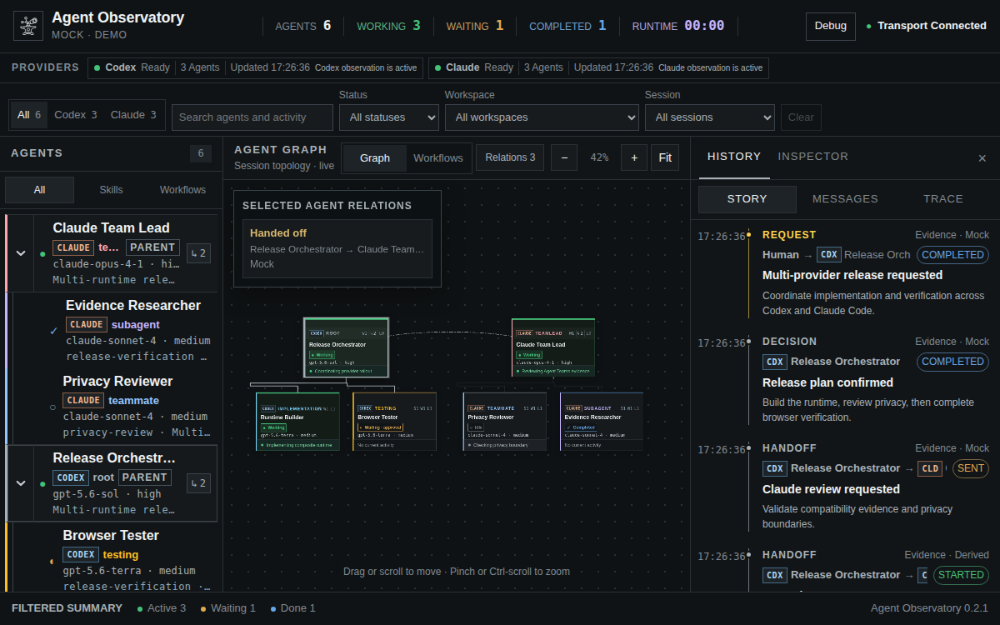
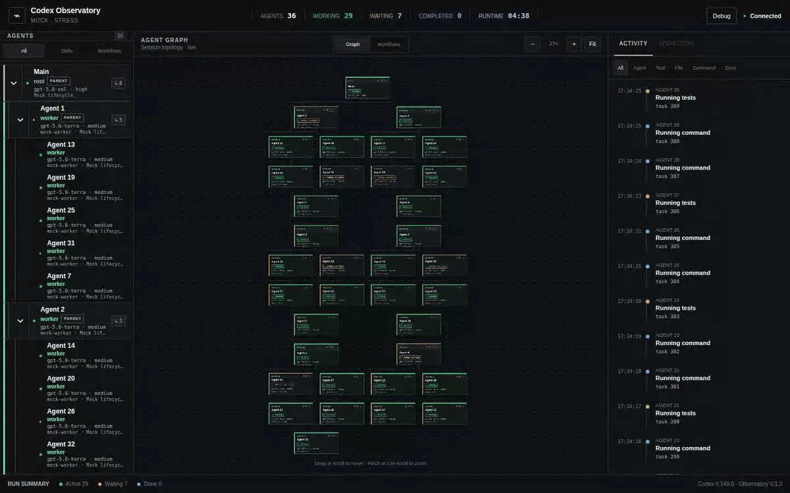

# Agent Observatory

[English](README.md) | [한국어](README.ko.md)

Agent Observatory는 Codex와 Claude Code 루트 에이전트 및 서브에이전트의 관계, 실행 상태,
현재 활동, 승인 또는 사용자 입력 대기, 최근 도구·파일·명령 활동을 한 화면에서 보는
로컬 에이전트 관측성 대시보드입니다.

로그를 그대로 출력하는 뷰어가 아니라 provider 프로토콜과 로컬 호환성 근거를
Observatory 도메인 이벤트로 정규화한 뒤, 에이전트 그래프와 크기가 제한된 활동
타임라인으로 투영합니다.

여러 에이전트가 병렬로 일할 때 다음 질문에 빠르게 답하는 것이 목표입니다.

- 지금 누가 작업 중인가?
- 어떤 에이전트가 사용자 입력이나 승인을 기다리는가?
- 부모 에이전트와 서브에이전트는 어떻게 연결되어 있는가?
- 각 에이전트는 어떤 모델, 추론 강도, 스킬, 워크플로 근거를 사용하는가?
- 최근 어떤 명령, 도구, 파일 활동이 발생했는가?
- 어느 작업이 끝났고 어디에서 문제가 발생했는가?


[](https://www.npmjs.com/package/agent-observatory)

## 데모



<details>
<summary>Provider 필터, 관계 보기, Story, Inspector, Workflow Board 동작 보기</summary>



</details>

데모에는 로컬 세션 데이터 대신 결정론적이고 내용이 안전한 fixture를 사용합니다.
`bunx agent-observatory --scenario demo`로 동일한 화면을 실행할 수 있습니다.

## 빠른 시작

### bunx로 바로 실행

npm 패키지를 별도로 설치하지 않고 실행할 수 있습니다. 기본값은 Codex와 Claude를
모두 선택하는 Real Mode이며, 실행 후 브라우저가 자동으로 열립니다.

```bash
bunx agent-observatory
```

필요하면 Real Mode를 한 provider로 제한할 수 있습니다. 명시적인 `--real` 옵션도
호환성을 위해 계속 지원하지만 더 이상 필수는 아닙니다.

```bash
bunx agent-observatory --provider codex
bunx agent-observatory --provider claude
bunx agent-observatory --real --provider all
```

provider CLI나 실시간 세션 없이 실행하려면 Mock Mode를 명시합니다.

```bash
bunx agent-observatory --mock
bunx agent-observatory --scenario demo
```

특정 작업 디렉터리만 보거나 브라우저를 자동으로 열지 않을 수도 있습니다.

```bash
bunx agent-observatory --cwd /absolute/path/to/project
bunx agent-observatory --scenario stress --no-open
```

우선 사용하는 기본 주소는 <http://127.0.0.1:4317>입니다. 해당 포트가 이미 사용
중이면 CLI가 다음 가용 포트를 선택하고 최종 bootstrap URL을 출력합니다. 사용자가
`--port`를 명시한 경우에는 조용히 다른 포트로 변경하지 않습니다. 모든 옵션은
`bunx agent-observatory --help`로 확인할 수 있습니다.

### 패키지 레지스트리

공식 공개 패키지는 npmjs.org의
[`agent-observatory`](https://www.npmjs.com/package/agent-observatory)입니다.
이 저장소는 GitHub Packages에 별도의 scoped 패키지를 중복 배포하지 않으므로,
GitHub 저장소 사이드바의 **Packages** 영역이 비어 있어도 정상입니다. 릴리스
워크플로가 GitHub Release와 npm 버전을 동일하게 유지합니다.

### 저장소를 복제해서 개발

#### 1. Mock Mode로 시작

Codex가 설치되어 있지 않아도 픽스처와 실시간 모의 이벤트로 전체 UI를 확인할 수
있습니다.

```bash
git clone https://github.com/KamiJeong/agent-observatory.git
cd agent-observatory
bun install
bun run dev
```

백엔드가 출력하는 `Agent Observatory server` bootstrap URL을 여세요.
서버가 HttpOnly 로컬 세션 쿠키를 설정한 뒤 인증정보가 남지 않은
<http://127.0.0.1:4318>로 리다이렉트합니다.

#### 2. 현재 실행 중인 에이전트 관측

선택한 provider CLI 중 하나 이상이 설치되어 있고 로컬에서 에이전트 워크플로가
실행 중이라면 Real Mode를 사용합니다.

```bash
codex --version
claude --version
bun run dev:real
bun run dev:real -- --provider codex
bun run dev:real -- --provider claude
```

개발 실행기는 가능한 경우 인증된 대시보드를 자동으로 엽니다. 자동 실행되지 않으면
출력된 `Dashboard bootstrap` URL을 여세요. 기본적으로 Codex와 Claude를 함께 관측하며,
`--provider codex` 또는 `--provider claude`로 하나만 선택할 수 있습니다. 공유 호환
전송 방식은 현재 머신에서 관측 가능한 활성 Codex 작업 디렉터리를 함께 탐색합니다.
브라우저 자동 실행을 끄려면 `--no-open`을 사용하세요.

특정 프로젝트만 보고 싶다면 정확한 작업 디렉터리를 지정합니다. 개발용 실행기는
Linux, macOS, PowerShell, 명령 프롬프트에서 같은 옵션을 사용할 수 있습니다.

```bash
bun run dev:real -- --cwd /absolute/path/to/project
```

## 화면 구성

- **Agents**: 부모/자식 트리, 상태, 역할, 모델/추론 강도, 스킬/워크플로 근거
- **Provider 상태 및 필터**: Codex/Claude 독립 상태와 provider, workspace, session, status, 검색 필터
- **Agent Graph**: 생성 토폴로지와 근거가 표시된 task, handoff, message 관계
- **Workflow Board**: 관측된 워크플로별 에이전트 레인과 Started/Status/Updated 정렬
- **Run History**: 요청, 결정, 인계, 전달, 완료를 Agent lane으로 보여 주는 인간 중심 히스토리
- **Trace**: 도구, 명령, 파일, 테스트, 오류 필터를 제공하는 저수준 가상화 타임라인
- **Inspector**: 선택한 에이전트의 런타임 메타데이터와 가상화된 최근 활동
- **Debug**: 프로토콜 이벤트, 정규화된 이벤트, 연결/버전 진단

Workflow Board의 `Observed order`는 에이전트 시작 시각이나 업데이트 시각으로 계산한
관측 순서입니다. Provider가 선언한 워크플로 단계 또는 오케스트레이션 소유권으로
간주하지 않습니다. 근거가 없으면 추측하지 않고 `No workflow evidence`로 표시합니다.

## 아키텍처

```text
Codex protocol/state ── RealCodexAdapter ─┐
                                         │
Claude transcripts ── ClaudeCodeAdapter ─┼─ CompositeRuntimeAdapter
                                         │             │
Mock scenario ──────── MockCodexAdapter ─┘             ▼
                                              normalized events
                                                      │
                                                      ▼
                                             Agent state projector
                                                      │
                                                      ▼
                                           Local HTTP/WebSocket server
                                                      │
                                                      ▼
                                                React dashboard
```

```text
apps/
  server/src/http/        API 라우팅, 세션, WebSocket, 정적 파일 전송 모듈
  web/src/components/    대시보드 기능별 재사용 React 컴포넌트
  web/src/lib/           프레임워크와 독립적인 그래프 배치 유틸리티
packages/
  codex-protocol/         생성된 프로토콜 버전 경계
  observatory-core/       도메인 타입, 그래프/상태 투영기, 상태 저장소
generated/
  codex*/                 Codex 0.149.0에서 생성한 TS 및 JSON Schema
docs/
  architecture.md         모듈 경계와 의존성 규칙
  accessibility.md        WCAG 측정값과 릴리스 검증 체크리스트
  codex-protocol.md       1단계 프로토콜 조사 결과 및 매핑 결정
```

서버와 대시보드의 모듈 책임, 의존 방향, 확장 지점은
[아키텍처 경계](docs/architecture.md)에서 확인할 수 있습니다.
[접근성 검증 가이드](docs/accessibility.md)에는 명암비 측정값, 자동화 범위,
수동 릴리스 체크리스트가 정리되어 있습니다.

React 컴포넌트는 원시 provider 레코드를 직접 사용하지 않습니다. 알려진 엔벌로프는
관대하게 정규화하고, 추가 필드를 허용하며, 잘못된 이벤트는 크기가 제한된 디버그
버퍼로 보내고, 알 수 없는 메서드 때문에 대시보드가 중단되지 않게 합니다.

## 기능

- 네이티브 근거 기반 상태를 표시하는 접이식 부모/자식 에이전트 목록
- 장애가 격리된 하나의 composite runtime에서 Codex와 Claude 동시 표시
- Provider 상태 및 provider/session/workspace/status/검색 필터
- 설정, 빈 상태, 권한, 미지원 버전, 부분 장애에 대한 복구 안내
- 시맨틱 HTML 노드와 SVG 연결선으로 구성한 루트/서브에이전트 트리
- 근거 출처가 표시되는 spawn, task, handoff, message 관계
- 그래프 이동, 확대·축소, 맞춤, 키보드 선택, 활성 선택 강조
- 에이전트 목록, 그래프 노드, Inspector에 관측된 모델과 추론 강도 표시
- 에이전트 필터 및 노드별 마커가 있는 관측된 스킬/워크플로 문맥
- 관측 순서/상태/업데이트 정렬을 지원하는 근거 기반 Workflow Board
- 송신자, 수신자, 완료 상태를 명시하는 Human/Agent 실행 히스토리. 내용은 fixture 또는 명시적 opt-in에서만 제한적으로 표시
- Git 스타일 Agent lane을 사용하는 Story, Messages, 저수준 Trace 보기
- 가상화된 최근 활동, 스레드, 작업 디렉터리, 선택적 토큰 사용량을 제공하는 Inspector
- 필터와 300개 이벤트 메모리 제한이 있는 가상화 활동 타임라인
- 명시적인 승인 및 사용자 입력 대기 사유
- Claude Agent Teams beta 역할, task 조정, peer message, shutdown 근거
- 연결 상태 및 지터가 적용된 지수 백오프 재연결
- 선택적으로 사용할 수 있는 크기 제한 프로토콜 디버그 패널
- Mock 시나리오 A, B, demo 및 35개 에이전트 스트레스 모드
- 에이전트 목록 → 그래프 → 활동 순서의 반응형 재배치

상태를 추측하지 않습니다.

```text
active + waiting flag  → WAITING
active                 → WORKING
idle                   → IDLE
systemError            → FAILED
notLoaded              → UNKNOWN
collab completed       → COMPLETED
```

특히 `notLoaded`와 `thread/closed`는 완료를 의미하지 않습니다.

## 플랫폼 지원

| Provider | 플랫폼 | Real Mode 탐색 방식 | 상태 |
| --- | --- | --- | --- |
| Codex | Linux / WSL2 | `/proc`에서 대화형 프로세스의 cwd를 읽음 | 지원됨, WSL2 Linux에서 로컬 검증 |
| Codex | macOS | `ps`로 프로세스를 찾고 `lsof`로 cwd를 확인 | 구현됨, 네이티브 기기 검증 예정 |
| Codex | Windows | PowerShell CIM 사용, `-C`/`--cd`가 없으면 최근 Codex 상태 선택 | 구현됨, 네이티브 기기 검증 예정 |
| Claude | Linux / WSL2 | procfs cwd와 제한된 transcript 및 Agent Teams 호환성 근거 사용 | 지원됨, WSL2 Linux에서 로컬 검증 |
| Claude | macOS / Windows | 정확한 live process mapping 없이 transcript-only 기록 탐색 | 호환성 fallback, 네이티브 기기 검증 예정 |

Codex와 Observatory는 같은 OS 환경에서 실행되고 동일한 `CODEX_HOME`을 사용해야
합니다. 예를 들어 네이티브 Windows에서 실행한 Observatory는 WSL 안에서 실행 중인
Codex를 찾을 수 없습니다. 둘 다 WSL 안에서 실행하거나 둘 다 Windows에서 실행하세요.

네이티브 Windows에서는 Codex를 명시적인 cwd와 함께 시작하면 프로젝트를 정확하게
연결할 수 있습니다.

```powershell
codex -C C:\projects\my-app
bun run dev:real -- --cwd C:\projects\my-app
```

`-C`/`--cd`가 없으면 Windows CIM은 프로세스 작업 디렉터리를 제공하지 않습니다.
이때 Observatory는 감지한 대화형 Codex 프로세스 수만큼 가장 최근의 보관되지 않은
루트를 선택하며, 이 근사 탐색 사실을 Debug에 기록합니다.

## 요구 사항

- Node.js 22.13 이상 (`node:sqlite` 필요)
- Bun 1.3.14
- Real Mode용 Codex CLI 0.149.x
- 현재 검증된 Claude 호환 어댑터용 Claude Code 2.1.241
- macOS: 시스템 `ps`, `lsof` 명령
- Windows: CIM을 사용할 수 있는 Windows PowerShell

Mock Mode에는 두 CLI 모두 필요하지 않습니다. 결합 Real Mode는 Codex와 Claude의
상태를 독립적으로 표시하므로 한 provider를 사용할 수 없어도 다른 provider는 계속
표시됩니다. 한 런타임만 사용하려면 `--provider`로 제한할 수 있습니다.

## 개발

```bash
bun run dev          # 서버 :4317 + Vite :4318, Mock 시나리오 A
bun run dev:real     # 기본적으로 Codex + Claude를 관측하는 Real Mode 실행기
bun run typecheck
bun run test
bun run test:e2e
bun run build
bun run demo:capture # 안전한 README PNG/GIF 재생성, ffmpeg 필요
```

기여 작업은 단기 브랜치와 `main` 대상 Pull Request를 사용합니다. 브랜치, 리뷰,
CI 및 npm 릴리스 절차는 [`CONTRIBUTING.md`](CONTRIBUTING.md)를 참고하세요.

`bun run build` 후에는 로컬 백엔드에서 프로덕션 웹 번들을 제공할 수 있습니다.

```bash
bun run --filter @observatory/server start
```

그런 다음 서버가 출력한 token 포함 로컬 bootstrap URL을 여세요. token은 HttpOnly,
SameSite 세션 쿠키를 설정할 때 한 번만 사용되고 리다이렉트 후 브라우저 URL에서
제거됩니다.

## Mock Mode

시나리오 A는 완료 정의(Definition of Done) 생명주기를 나타냅니다.

```text
Main ●
├─ Researcher ● → ✓
├─ Implementer ● → ✓
└─ Tester ● → ◐ approval → ● → ✓
```

다른 픽스처는 다음과 같이 실행합니다.

```bash
OBSERVATORY_SCENARIO=b bun run dev
OBSERVATORY_SCENARIO=demo bun run dev
OBSERVATORY_SCENARIO=stress bun run dev
```

- `a`: 생성, 활동, 완료, 승인 대기, 복구
- `b`: 중첩된 프런트엔드/테스트 에이전트, 완료된 백엔드, 실패한 리뷰어
- `demo`: 결정론적 Codex + Claude provider, 관계, 필터, workflow 데모
- `stress`: 결정론적 상태/활동 업데이트가 계속되는 35개 에이전트

## Real Codex Mode

Real Mode는 기본적으로 공유 호환 전송 방식을 사용합니다. 현재 머신에서 실행 중인
대화형 Codex 프로세스를 탐색하고, Codex의 버전 관리 상태 데이터베이스에서 루트
스레드를 선택하고, `thread_spawn_edges`로 자손 트리를 구성하고, 파일 시스템
감시자로 롤아웃 이벤트를 추적합니다. 이를 통해 하나의 대시보드에서 `project-a`,
`project-b`처럼 여러 작업 디렉터리를 함께 볼 수 있습니다.

```bash
bun run dev:real
```

공유 전송 방식은 기본적으로 모든 활성 Codex 작업 디렉터리를 표시합니다. 대시보드를
정확한 한 경로로 제한해야 할 때만 `OBSERVATORY_CWD`를 설정하세요.

환경 변수:

| 변수 | 기본값 | 용도 |
| --- | --- | --- |
| `OBSERVATORY_ADAPTER` | `mock` | Provider 기반 Real Mode에서는 `real`로 설정 |
| `OBSERVATORY_PROVIDERS` | 서버는 `codex`, `dev:real`은 `codex,claude` | 관측할 provider 목록: `codex`, `claude` 또는 `codex,claude` |
| `OBSERVATORY_PORT` | `4317` | 백엔드 HTTP/WebSocket 포트 |
| `OBSERVATORY_CWD` | 공유 모드에서 `all` | 정확한 작업 디렉터리 필터. 비활성화하려면 `all` 사용 |
| `OBSERVATORY_ROOT_THREAD_ID` | 미설정 | 루트 하나와 그 자손만 포함 |
| `OBSERVATORY_CODEX_TRANSPORT` | `shared` | `shared`, `standalone` 또는 실험적 `proxy` |
| `OBSERVATORY_SCENARIO` | `a` | Mock 픽스처: `a`, `b`, `demo` 또는 `stress` |
| `OBSERVATORY_CAPTURE_CONTENT` | 미설정 | 기본 metadata-only. 로컬 브라우저에서 제한된 provider 내용을 보려면 `1`로 설정 |

예시:

```bash
bun run dev:real -- --root-thread 019f...
```

### 실시간 관측 범위

권장 소스는 생성된 App Server 프로토콜입니다. 그러나 App Server 구독은
연결/런타임 범위에 한정되며, 새로 생성한 전용 App Server는 다른 프로세스가 소유한
실시간 상태를 재구성할 수 없습니다. `shared` 전송 방식은 조사한 Codex 0.149.0
환경을 위한 격리된 호환 어댑터입니다. 크기가 제한된 롤아웃 꼬리에서 명시적인
`task_started`, `task_complete`, `turn_context` 모델/추론 강도, 도구 호출 근거를
사용하며, `notLoaded`를 완료로 취급하지 않습니다. 업데이트는 과도한 폴링 대신
파일 시스템 알림과 15초 안전 갱신으로 구동됩니다. 스킬 배지는 최근 도구 명령이
해당 스킬의 `SKILL.md`를 명시적으로 읽었음을 뜻하며, 스킬이 단순히 설치되어 있다는
뜻은 아닙니다. 워크플로 배지는 현재 명시적인 협업 모드/계획 도구와 관측된 `.sdd`
워크플로 근거를 사용합니다.

`OBSERVATORY_CODEX_TRANSPORT=proxy`는 관리형 App Server 데몬을 통한 연결을 위해
예약되어 있습니다. 현재 호스트는 내부 제어 소켓 프레이밍 경로를 사용합니다.
공식 `codex agents` 화면은 이를 탐색할 수 있지만, `codex app-server proxy`를 통해
전송한 공개 JSON-RPC 초기화 요청에는 응답하지 않습니다. 따라서 Proxy는 점진적
향상 기능으로 남아 있습니다.

생성된 JSONL 프로토콜 어댑터를 직접 테스트하려면
`OBSERVATORY_CODEX_TRANSPORT=standalone`을 사용하세요. 이 모드에서는 다른 런타임에
속한 영속 스레드가 올바르게 `UNKNOWN`으로 표시됩니다.

## 지원하는 Codex 버전

저장소에 포함된 프로토콜 산출물과 정규화기는 다음 버전을 기준으로 검토했습니다.

```text
codex-cli 0.149.0
```

공유 호환 어댑터는 `codex-cli 0.149.1`로도 스모크 테스트했습니다.

런타임에서 디버그 패널은 다음을 기록합니다.

- Codex CLI 버전
- 생성된 프로토콜 버전
- Observatory 버전
- 실험적 API 상태
- 활성 탐색 전략

필드 추가를 허용하는 방식으로 파싱하므로 다른 Codex 버전도 동작할 수 있지만,
바인딩을 다시 생성하고 테스트를 통과하기 전까지 공식 지원한다고 간주하지 않습니다.

## Real Claude Code Mode

Claude 관측은 버전을 인식하는 읽기 전용 호환성 어댑터입니다. Linux에서는 활성 작업
디렉터리를 찾고, 크기가 제한된 root/subagent transcript tail과 Agent Teams beta의
config, task, mailbox 메타데이터를 읽습니다. Prompt, response, thinking, command,
tool input, task 내용, mailbox 본문은 보관하지 않습니다. 다른 플랫폼은 현재
transcript-only 기록 탐색을 사용합니다. 공식 hook과 OpenTelemetry는 향후 정확도
향상 항목입니다. 근거, 개인정보, 버전 경계는
[Claude 호환성 문서](docs/claude-compatibility.md)를 참고하세요.

## 프로토콜 생성

설치된 Codex 버전을 변경한 후 다음을 실행합니다.

```bash
codex --version
codex app-server --help
codex app-server generate-ts --help
codex app-server generate-json-schema --help

codex app-server generate-ts --out ./generated/codex
codex app-server generate-json-schema --out ./generated/codex-schema
codex app-server generate-ts --out ./generated/codex-experimental --experimental
codex app-server generate-json-schema --out ./generated/codex-schema-experimental --experimental
```

그런 다음 `packages/codex-protocol/src/index.ts`의 검토된 버전 상수를 업데이트하고,
[`docs/codex-protocol.md`](docs/codex-protocol.md)를 수정한 뒤 전체 테스트 스위트를
실행합니다. 생성된 파일은 수동으로 편집하면 안 됩니다.

사용 가능한 경우 활용하는 실험적 API:

- `thread/list({ ancestorThreadId })`
- `thread/list({ parentThreadId })`
- `thread/turns/list`
- `thread/items/list`

실패하면 스레드 메타데이터와 관측된 이벤트를 사용하는 호환 탐색 방식으로
폴백합니다.

## 테스트

```bash
bun run test         # 단위, 통합, CLI, UI 테스트 스위트
bun run test:e2e     # Chromium Mock 생명주기
bun run build        # 타입 검사 + 프로덕션 프런트엔드 빌드
```

테스트 범위:

- 네이티브 → Observatory 상태 투영
- 부모-자식 그래프 구성
- 잘못되었거나 알 수 없는 프로토콜 입력
- 명령/테스트/파일/도구 활동 정규화
- 명시적인 협업 완료 근거
- Mock 어댑터 → 상태 통합
- 그래프/목록 노드 선택 및 대기 상태 Inspector
- 브라우저 생성 → 완료 → 대기 → Inspector 흐름

## 문제 해결

### 브라우저가 자동으로 열리지 않음

최소 구성 Linux 컨테이너와 헤드리스 환경에는 `xdg-open`이 없을 수 있습니다.
브라우저를 자동으로 열 수 없어도 Observatory는 계속 실행되며 로컬 URL을
출력합니다. 브라우저 실행을 명시적으로 끄고 URL을 직접 여세요.

```bash
bunx agent-observatory --real --no-open
```

### 대시보드의 연결 끊김 상태가 지속됨

먼저 백엔드를 확인하세요.

```bash
curl http://127.0.0.1:4317/api/health
```

브라우저는 지수 백오프로 로컬 WebSocket 연결을 재시도합니다. Real 어댑터는 App
Server 프로세스 종료를 별도로 재시도합니다. 연결과 프로토콜 요약은 Debug 패널에서
확인할 수 있으며, 원시 스택 트레이스는 기본 UI에 노출되지 않습니다.

대시보드에 인증이 필요하다는 메시지가 표시되면 Vite 포트를 직접 열지 마세요.
Observatory를 다시 시작하고 가장 최근에 출력된 `Agent Observatory server`
또는 `Dashboard bootstrap` URL을 사용하세요. 이전 서버 프로세스의 세션은 재시작 후
의도적으로 무효화됩니다.

### Real Mode에 UNKNOWN이 표시됨

일반적으로 App Server가 `status: { type: "notLoaded" }`를 반환했다는 뜻입니다.
이는 유효한 상태이며 작업 완료를 의미하지 않습니다. Observatory가 해당 스레드를
소유한 런타임에 연결되었는지 확인하거나, UI를 개발하는 동안 Mock Mode를 사용하세요.

### Real Mode에 스레드가 표시되지 않음

기본 작업 디렉터리 범위가 스레드와 일치하지 않을 수 있습니다. 정확한 디렉터리를
지정하거나 범위를 비활성화하세요.

```bash
bun run dev:real -- --cwd /path/to/project
bun run dev:real -- --cwd all
```

알려진 워크플로 루트가 있다면 `OBSERVATORY_ROOT_THREAD_ID`를 사용하는 편이 좋습니다.
관련 없는 기록을 UI에 불러오지 않고 실험적 자손 탐색을 사용할 수 있습니다.

### 실험적 탐색을 사용할 수 없음

어댑터는 호환성 알림을 기록하고 실험적 전략을 비활성화한 뒤 안정적인 메타데이터를
계속 사용합니다. 대시보드는 계속 사용할 수 있어야 합니다.

## 범위

이 MVP는 의도적으로 터미널 에뮬레이터, 오케스트레이션 엔진, IDE, Git 클라이언트,
세션 재생, 클라우드 동기화, 분석 또는 토큰 과금 기능을 제공하지 않습니다. 누가
작업 중인지, 무엇을 하는지, 무엇을 기다리는지, 무엇이 끝났는지, 어디에서 오류가
발생했는지 답하는 것이 목적입니다.
